# AppleHealth 健康应用

​	

<!-- TOC -->
## 目录
- [AppleHealth 健康应用](#applehealth-健康应用)
  - [目录](#目录)
  - [1.项目概述](#1项目概述)
    - [1.1.项目简介](#11项目简介)
    - [1.2. 目标](#12-目标)
    - [1.3.技术路线](#13技术路线)
    - [1.4.项目结构](#14项目结构)
  - [2.功能特性](#2功能特性)
    - [2.1 核心功能复刻](#21-核心功能复刻)
    - [2.2 数据展示系统](#22-数据展示系统)
    - [2.3 交互功能](#23-交互功能)
    - [2.4 创新扩展功能](#24-创新扩展功能)
  - [3.技术架构](#3技术架构)
    - [架构与技术栈](#架构与技术栈)
  - [4.页面功能及其跳转逻辑](#4页面功能及其跳转逻辑)
    - [4.1.页面功能](#41页面功能)
      - [功能与页面映射表](#功能与页面映射表)
    - [4.2.页面详情](#42页面详情)
      - [4.2.1.Index（主入口）](#421index主入口)
      - [4.2.2.UserInfoCollect](#422userinfocollect)
        - [4.2.2.1.功能架构](#4221功能架构)
        - [4.2.2.2.核心交互特性](#4222核心交互特性)
        - [4.2.2.3.完成了但是并未获得开发者权限的功能](#4223完成了但是并未获得开发者权限的功能)
        - [4.2.2.4.完成了但是被修改掉的功能](#4224完成了但是被修改掉的功能)
      - [4.2.3.AbstractPage](#423abstractpage)
        - [功能概述](#功能概述)
        - [数据可视化](#数据可视化)
        - [页面模板组件](#页面模板组件)
        - [AbstractPage组件生命周期管理](#abstractpage组件生命周期管理)
        - [未完全实现的功能](#未完全实现的功能)
          - [动态UI效果](#动态ui效果)
          - [传感器集成](#传感器集成)
      - [4.2.4.DetailPage](#424detailpage)
        - [功能概述](#功能概述-1)
        - [数据可视化展示](#数据可视化展示)
        - [时间范围切换](#时间范围切换)
        - [数据管理机制](#数据管理机制)
        - [UI组件复用](#ui组件复用)
        - [页面交互流程](#页面交互流程)
        - [未来优化方向](#未来优化方向)
      - [4.2.5.BrowsePage](#425browsepage)
        - [功能概述](#功能概述-2)
        - [搜索与过滤逻辑](#搜索与过滤逻辑)
          - [路由导航](#路由导航)
          - [UI组件构建](#ui组件构建)
        - [未来优化方向](#未来优化方向-1)
      - [4.2.6.CategoryDetailPage](#426categorydetailpage)
        - [功能概述](#功能概述-3)
        - [交互特性](#交互特性)
        - [未来优化方向](#未来优化方向-2)
      - [4.2.7.SharePage](#427sharepage)
        - [功能概述](#功能概述-4)
        - [路由导航](#路由导航-1)
          - [视觉设计](#视觉设计)
        - [未来优化方向](#未来优化方向-3)
      - [4.2.8.ResearchPage](#428researchpage)
        - [功能概述](#功能概述-5)
        - [数据结构设计](#数据结构设计)
          - [路由导航](#路由导航-2)
      - [4.2.9.AppPage](#429apppage)
        - [功能概述](#功能概述-6)
        - [数据结构设计](#数据结构设计-1)
        - [路由导航](#路由导航-3)
    - [4.3.页面跳转逻辑](#43页面跳转逻辑)
      - [4.3.1.页面跳转逻辑示意图](#431页面跳转逻辑示意图)
      - [4.3.2.跳转逻辑说明表](#432跳转逻辑说明表)
  - [5.健康数据管理](#5健康数据管理)
    - [5.1.数据模型设计](#51数据模型设计)
      - [5.1.1.核心数据结构](#511核心数据结构)
        - [类图](#类图)
      - [5.1.2.全局健康数据管理](#512全局健康数据管理)
    - [5.2.HealthDataStore单例模式](#52healthdatastore单例模式)
      - [5.2.1.设计原理](#521设计原理)
      - [5.2.2.数据管理方法](#522数据管理方法)
    - [5.3.传感器集成](#53传感器集成)
      - [5.3.1.步数传感器](#531步数传感器)
  - [6.权限管理机制](#6权限管理机制)
      - [权限管理流程示意图](#权限管理流程示意图)
    - [6.1.在`module.json5`声明权限](#61在modulejson5声明权限)
    - [6.2.权限关联](#62权限关联)
    - [6.3.权限申请](#63权限申请)
    - [6.4.授权检查](#64授权检查)
    - [6.5.权限序列图](#65权限序列图)
  - [7.本地化适配](#7本地化适配)
    - [7.1.已实现](#71已实现)
    - [7.2.待实现](#72待实现)
  - [8.开发环境指南](#8开发环境指南)
    - [环境要求](#环境要求)
  - [9.项目整体未来计划](#9项目整体未来计划)
  - [许可证（MIT Licence）](#许可证mit-licence)
    - [被授权人权利](#被授权人权利)
    - [被授权人义务](#被授权人义务)
<!-- TOC -->


## 1.项目概述

### 1.1.项目简介
本项目是一个面向HarmonyOS NEXT设备打造的智能健康管理平台，主要功能模块包括：
- 核心健康指标看板（心率、血氧、睡眠等）
- 分类浏览（如呼吸、心脏等）
- 健康数据的总结性展示（如每日摘要）
- 详细查看特定健康指标（如步数、活跃能量、BMI等）
- 智能提醒系统（久坐、心率异常等）

### 1.2. 目标
本项目旨在为用户提供与苹果“健康”应用相似的体验。通过1：1复刻核心界面和功能，同时增加创新功能，如健康提醒、趋势分析等，提升用户交互和数据管理能力。

### 1.3.技术路线
本项目采用组件化架构，结合HarmonyOS的传感器、和UI组件，实现了实时健康数据追踪、分享和个性化设置，并且利用其原生 API 实现实时数据跟踪和安全的数据管理。应用基于 HarmonyOS ArkUI（方舟UI） 框架开发，使用 ETS 语言，集成了传感器、位置服务和通知等功能。数据通过 `AppStorage` 持久化存储，UI 采用响应式状态管理。

### 1.4.项目结构

```
AppleHealth/
├── entry/               # 应用入口
│   ├── src/
│   │   └── main/
│   │       └── ets/
│   │           ├── common/           # 公共组件
│   │           │   ├── constants/    # 常量定义
│   │           │   └── utils/        # 工具类
│   │           ├── entryability/     # 应用能力
│   │           │   └── EntryAbility.ets
│   │           ├── entrybackupability/
│   │           │   └── EntryBackupAbility.ets
│   │           ├── model/            # 数据模型
│   │           │   ├── Health.ets    # 健康数据接口
│   │           │   ├── Healthy.ets   # 全局健康数据
│   │           │   └── UserInfo.ets  # 用户信息
│   │           ├── pages/            # 页面组件
│   │           │   ├── AbstractPage.ets     # 健康指标仪表板
│   │           │   ├── AppPage.ets          # 通用页面模板
│   │           │   ├── BrowsePage.ets       # 分类浏览
│   │           │   ├── CategoryDetailPage.ets # 分类详情
│   │           │   ├── DetailPage.ets       # 指标详情
│   │           │   ├── Index.ets            # 主入口
│   │           │   ├── ResearchPage.ets     # 研究权限管理
│   │           │   ├── SharePage.ets        # 数据共享
│   │           │   └── UserInfoCollect.ets  # 用户数据收集
│   │           └── view/             # 视图组件
│   │               ├── CompletionStatus.ets
│   │               ├── CurrentSituation.ets
│   │               └── InputDialog.ets
│   ├── build-profile.json5
│   ├── hvigorfile.ts
│   └── oh-package.json5
├── AppScope/            # 应用配置
├── Image/               # 图片资源
│   ├── AbstractPage.gif
│   ├── DataVisualization.png
│   └── ... (其他图片资源)
├── hvigor/              # 构建工具配置
│   └── hvigor-config.json5
├── Readme.md            # 项目文档
└── oh-package.json5     # 项目配置
```

## 2.功能特性

### 2.1 核心功能复刻
- **首次启动向导**  
  采用`PersistentStorage`实现用户信息持久化存储，二次启动自动跳过信息收集流程
  
- **健康数据看板**  
  实时展示步数（`@ohos.sensor`）、活动能量（`HealthDataStore`计算）、BMI（基于`UserInfo`数据）等核心指标

### 2.2 数据展示系统
- **分类浏览体系**  
  基于`BrowsePage`的路由架构（`router.pushUrl`），支持呼吸/心脏等12类健康数据检索

- **多维度可视化**  
  1:1复刻苹果健康应用的：
  - 日/周/月趋势图（`<LineChart>`组件）
  - 数据分布直方图（`<Histogram>`组件）
  - 交互式时间轴（`<showTextPicker>`控件）

### 2.3 交互功能
- **智能搜索**  
  支持关键字过滤（`@Watch`状态监听）和分类标签组合查询

- **数据共享机制**  
  包含：
  - 研究机构访问权限管理界面（`ResearchPage`占位）
  - 第三方应用授权管理界面（`SharePage`实现）

### 2.4 创新扩展功能
- **实时健康监测提醒**  
  - 异常通知（需`ohos.permission.NOTIFICATION和reminderAgentManager：`）
- **权限管理系统**  
  分层实现动态权限申请流程


## 3.技术架构

### 架构与技术栈

基于HarmonyO NEXT的ArkUI（方舟UI）的ETS（Extended TypeScript）语言开发。

- **组件化架构**：每个页面或功能模块独立为一个组件（如 `AbstractPage`、`BrowsePage`），提高可维护性。
主入口为Index.ets，负责初始化数据、验证用户信息并管理主导航。、
- **UI 设计**：采用声明式 UI的ArkUI，结合 `Column`、`Row`、`List` 等组件，创建直观界面。
- **MVVM**数据驱动架构：Model（模型）、View（视图）和ViewModel（视图模型）。
- `AppStorage`+`PersistentStorage.persistProp`**全局状态管理**
- PersistentStorage**数据持久化**
- **API**：HarmonyOS 原生 API，包括**传感器**（`@ohos.sensor`）、存储（`AppStorage`）和**通知**（`notificationManager`+`reminderAgentManager`）。
 - **实时传感器集成**：通过计步传感器实现步数实时跟踪。
- **持久化存储**：使用 `AppStorage` 保存用户数据和健康指标。
- **响应式状态管理**：通过 `@State` 和 `@Provide` 实现动态 UI 更新。
- **自定义可视化**：为历史数据提供直方图和图表展示。
- **权限管理**：处理传感器、位置和通知权限，确保数据安全。
- **通知系统**：支持健康跟踪提醒，如每日数据录入提示。
- **路由系统**：通过 `router` 模块实现页面间导航（如 `router.pushUrl`、`router.back`）。
- **生命周期管理**：页面使用 `aboutToAppear`、`onPageShow` 等方法进行初始化和清理。
- **异常处理**：通过 try-catch 和日志记录处理权限、传感器等操作的异常。
- **单例模式**的运用：
  - `HealthDataStore` 单例模式用于管理健康数据。
  - `PermissionManager` 单例模式用于管理权限申请和检查。

## 4.页面功能及其跳转逻辑

### 4.1.页面功能

#### 功能与页面映射表
以下表格总结了应用的主要功能及其对应的页面：
| 功能           | 页面               | 描述                             |
| -------------- | ------------------ | -------------------------------- |
| 健康指标仪表板 | AbstractPage       | 显示实时健康指标和历史趋势       |
| 分类浏览       | BrowsePage         | 浏览健康分类，支持搜索和过滤     |
| 分类详情       | CategoryDetailPage | 显示分类下的具体指标             |
| 指标详情       | DetailPage         | 提供单个指标的详细信息和数据录入 |
| 数据共享       | SharePage          | 管理健康数据共享和权限           |
| 研究权限管理   | ResearchPage       | 管理研究机构数据访问（占位）     |
| 用户数据收集   | UserInfoCollect    | 引导用户录入个人信息             |
| 主导航         | Index              | 提供选项卡导航和用户信息检查     |
| 通用页面模板   | AppPage            | 提供返回按钮和动态标题的页面模板 |


### 4.2.页面详情

#### 4.2.1.Index（主入口）
- **功能架构**：
  - 应用总控模块，协调数据初始化与页面导航
  - 采用MVVM模式分离视图与业务逻辑

- **核心特性**：
  - 用户信息完整性验证
  - 三栏式底部导航（摘要/分享/浏览）
  - 自适应弹窗控制系统

- **性能优化措施**：
  1. 使用`PersistentStorage`减少AppStorage访问频次并且实现数据持久化。
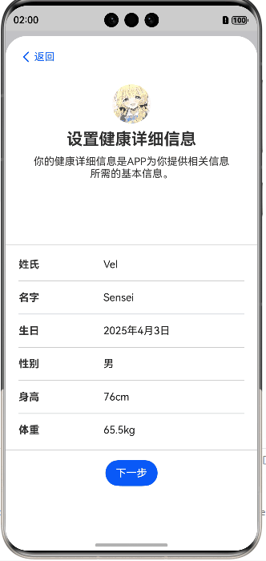
  2. 使用`@StorageLink`进行数据绑定，确保数据的实时更新。
  3. 只有删除APP才会还原持久化存储，后台退出之后不会再重复收集用户信息

- **试用bindSheet绑定半模态界面实现半模态转场**：

- `bindSheet`方法实现半模态转场：
  - 弹窗展示时，用户可以继续在主页面操作，但弹窗内容会覆盖部分主页面内容。
  - 弹窗内容可以滚动，但不会影响主页面滚动。
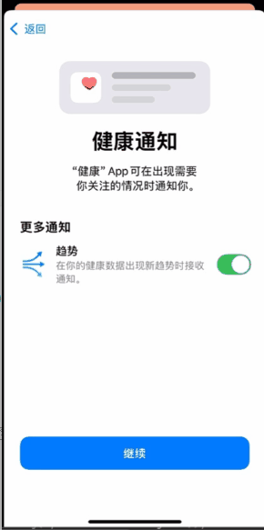


| 参数项        | 配置值              | 作用描述                 |
| ------------- | ------------------- | ------------------------ |
| detents       | [SheetSize.LARGE]×3 | 控制弹窗高度占比         |
| blurStyle     | BlurStyle.Thick     | 背景模糊效果             |
| onWillDismiss | 重置isShow状态      | 防止内存泄漏             |
| dragBar       | false               | 隐藏拖动条提升视觉统一性 |

- `tabBarDynamic`实现动态tabBar：
  - 当用户点击tabBar时，切换到对应的页面，tabBar是否被选中时颜色有不同。
 

- **权限检查机制**：
  1. 启动时校验`ohos.permission.READ_HEALTH_DATA`
  2. 弹窗显示前检查`ohos.permission.SYSTEM_FLOAT_WINDOW`
  3. 位置服务动态申请`ohos.permission.LOCATION`

        


#### 4.2.2.UserInfoCollect

##### 4.2.2.1.功能架构
  - 四步式用户引导流程（欢迎→隐私→通知→信息收集）
  - 1：1复刻原软件使用体验的开屏界面
  - 采用Swiper组件实现页面切换（主要是为了四个页面的**左右切换动效**）


- **关键技术实现**：
  - **权限管理**：通过`requestPermissionsFromUser`方法动态申请权限。

  - **Notification弹窗通知**
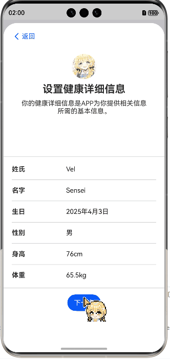


##### 4.2.2.2.核心交互特性

1. 智能表单验证：
当表单没有填写完全的时候，确认键是不可以点击的，使用了button的enabled属性和一个动态刷新的本组件方法来完成的。
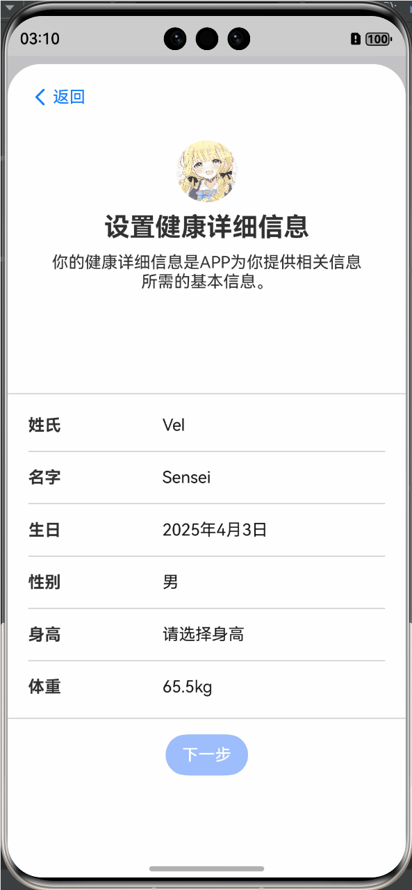
2. 动态数据选择器：

使用`TextPickerDialog`实现身高和体重选择器，用户选择后更新 `tempUserInfo` 对象的对应属性。range使用Foreach循环生成，onAccept回调函数中处理用户选择的数据。与DataPicker组件不同的是，TextPickerDialog完全还原了原UI和操作体验。


##### 4.2.2.3.完成了但是并未获得开发者权限的功能
  - **后台通知权限**`reminderAgentManager：`
在代码中已经实现了，但是开发者权限还未获得。Log中打印出Error，显示Reminder Exceeds Limit（提醒数量达到限制），在翻阅文档之后，得知消息数量需要写邮件申请开发者权限。十个工作日之后得到回复之后在过一个工作日，方可继续使用。
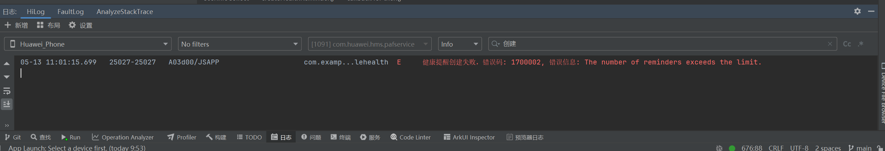
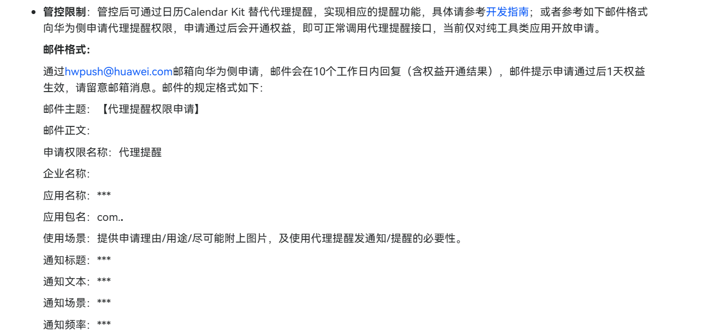
原本应该当达成的目标是会在下滑窗口中展示一个消息通知，并且会根据用户所给的权限来决定是否弹窗,类似下图所示的效果：
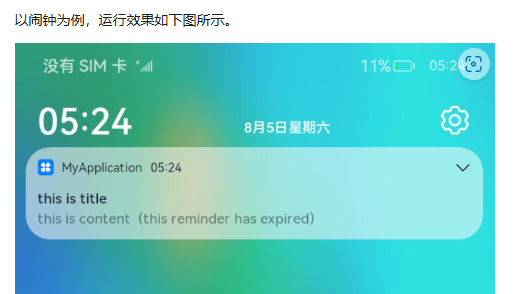

##### 4.2.2.4.完成了但是被修改掉的功能
  - **主动动画效果**`TransitionEffect`
在代码中已经实现了，但是由于后续优化，把初次登陆的弹窗改在bindSheet中，四个页面的左右动画修改优化为

原本达成的动画淡入淡出效果如下图所示：


- **权限管理矩阵**：

| 权限类型                        | 申请时机       | 实现方法                     |
| ------------------------------- | -------------- | ---------------------------- |
| ohos.permission.ACTIVITY_MOTION | 通知权限页     | requestPermissionsFromUser() |
| SYSTEM_FLOAT_WINDOW             | 弹窗显示前     | bindSheet自动处理            |
| LOCATION                        | 位置服务使用时 | 动态申请                     |


          

#### 4.2.3.AbstractPage

##### 功能概述
- **主要功能**：展示今日健康指标，包括步数、活动能量、身高、体重、BMI和爬楼层数
- **数据展示**：每项指标显示过去7天的直方图，通过柱状图可视化健康数据趋势
- **实时更新**：使用计步传感器实时更新步数，支持位置跟踪显示用户当前位置
大致实现的功能如下图所示：
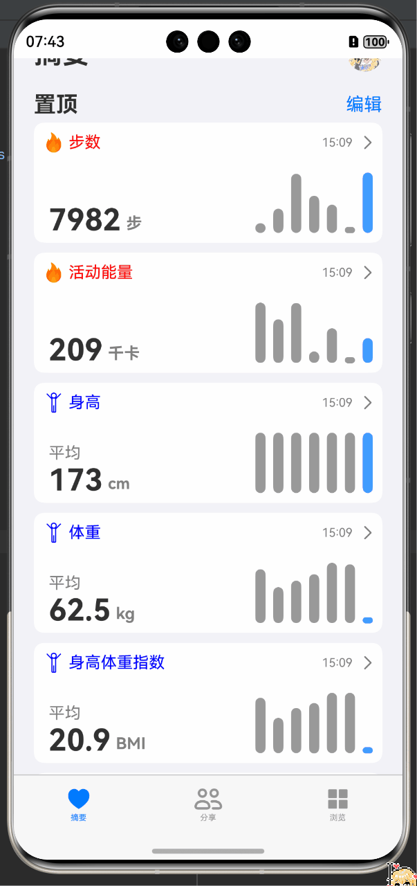


##### 数据可视化
- **柱状图组件**：自定义`HistogramChart`组件，根据健康参数类型动态渲染柱状图
- **动态高度计算**：通过`calculateHealthPercentage`方法计算每个柱子的相对高度
- **颜色区分**：当天数据使用蓝色(#419cff)，历史数据使用灰色(#999999)
- **数据更新**：在数据收到修改时，在页面显示时重新计算数据


##### 页面模板组件
- **健身数据模板**：`fitnessTemplate`用于展示步数、活动能量和爬楼层数等运动数据
- **身体数据模板**：`bodyTemplate`用于展示身高、体重和BMI等身体数据
- **点击跳转**：点击任一指标卡片跳转至`DetailPage`，传递类型、数据和单位参数

##### AbstractPage组件生命周期管理
- **aboutToAppear**：初始化数据、计算BMI、请求权限、启动传感器监听
- **aboutToDisappear**：关闭传感器监听，释放资源
- **onPageShow**：页面显示时重新初始化数据和权限

##### 未完全实现的功能
###### 动态UI效果
在代码中`startBackgroundAnimation`已经大致实现动态刷新的效果，但是由于时间原因，未能完成UI的优化。后续只要在`build`中引入`Stack`组件并且使用`Canvas`画布组件进行绘制图画即可实现还原苹果的UI背景图上的动态效果。
目标要达成的效果如图所示：


###### 传感器集成
在代码中已经实现了传感器集成，但是由于获取权限失败的原因，未能完成传感器数据的实时更新。
在代码中已完成的工作包括：
  1. 在`module.json5`中声明权限所需`内容、使用位置、使用原因、使用时间`。
  2. 在代码中申请权限，并且使用`requestPermissionsFromUser`方法动态申请权限。(将应用中需要申请权限的目标对象与对应目标权限进行关联，让用户明确地知道，哪些操作需要用户向应用授予指定的权限。)
  3. 运行应用时，在用户触发访问操作目标对象时应该调用接口，精准触发动态授权弹框。该接口的内部会检查当前用户是否已经授权应用所需的权限，如果当前用户尚未授予应用所需的权限，该接口会拉起动态授权弹框，向用户请求授权。
  4. 当用户同意或拒绝授权时，会触发回调函数，开发者可以根据用户的选择来决定是否继续执行操作。
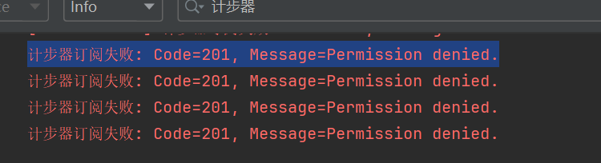

#### 4.2.4.DetailPage

##### 功能概述
- **主要功能**：提供单个健康指标的详细信息展示与数据管理
- **页面定位**：健康数据深度分析与交互界面
- **用户价值**：帮助用户追踪、分析和管理特定健康指标的历史变化

##### 数据可视化展示

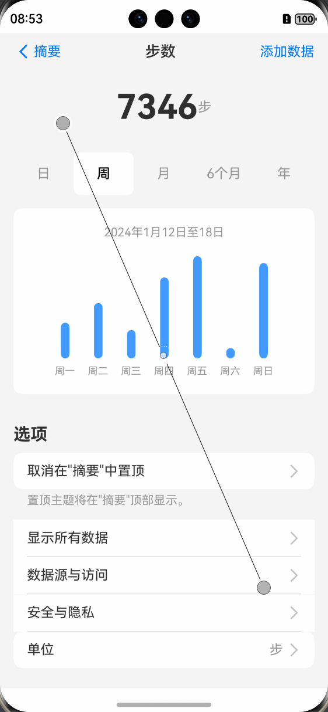

##### 时间范围切换
- **支持多种时间维度**：日、周、月、6个月、年
- **实现方式**：通过`@State selectedTimeRange`状态变量控制当前选中的时间范围
- **数据适配**：根据选中的时间范围动态调整数据展示和图表比例


##### 数据管理机制
- **数据源**：通过`HealthDataStore`单例模式管理健康数据
- **状态绑定**：使用`@StorageLink`装饰器实现数据与UI的双向绑定
- **数据计算**：`calculateHealthPercentage`方法动态计算柱状图高度百分比

##### UI组件复用
- **绘图与组件Builder**：创建可复用的UI组件，如`HistogramChart`和`OptionItem`
- **动态渲染**：根据健康参数类型动态渲染不同的UI组件
- **样式统一**：保持与苹果健康应用一致的视觉风格


##### 页面交互流程

1. **页面加载**：初始化数据、申请权限、启动传感器监听
2. **数据展示**：显示当前健康指标值、单位和历史数据柱状图
3. **时间范围切换**：用户可选择不同时间范围查看历史数据
4. **数据录入**：通过底部弹窗添加新的健康数据记录，所提交的数据会在`HealthDataStore`中更新，在页面显示时重新计算数据的Chart，实现**数据和数据缩略图实时更新**。
5. **返回导航**：使用顶部返回按钮返回上一页面，同时，上一个界面的**数据和数据缩略图**和也会实时更新。如果更改了身高或者体重，会**重新计算BMI**。**这一个功能IOS的健康应用中是没有的**，但是我们认为这个功能对于用户来说是非常有用的，因为用户在更改身高或者体重之后，可以立即看到BMI的变化，从而及时调整自己的饮食和运动计划。
下图展示了DetailPage的交互流程：
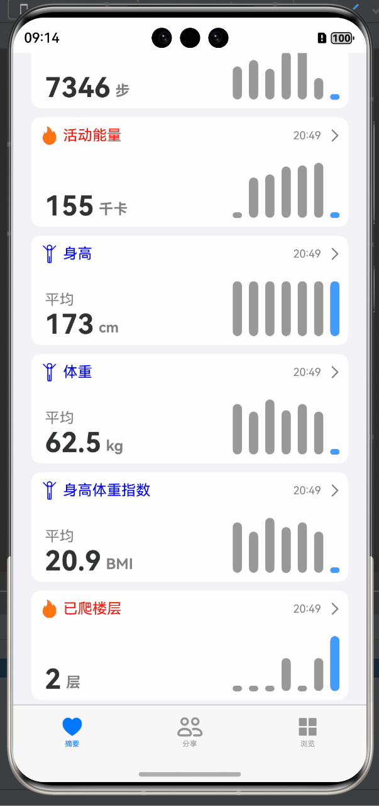

##### 未来优化方向

1. **数据可视化增强**：增加折线图、饼图等多种图表类型
2. **数据分析功能**：添加趋势分析、异常检测等高级功能
3. **用户交互优化**：优化数据录入流程，支持批量导入
4. **离线与在线数据同步**：实现**离线**数据收集和**后台**同步功能
5. **传感器实时数据集成**:尚未完全实现功能，原因与[AbstractPage的传感器集成](#传感器集成)相同，后续优化方向为：优化传感器实时数据集成，实现实时数据更新和位置跟踪功能。        

#### 4.2.5.BrowsePage

##### 功能概述
- **健康分类浏览**：提供多种健康类别的分类浏览功能，包括呼吸、活动能力、健身记录等15个健康分类。
- **搜索与过滤**：支持实时关键词搜索，动态过滤健康类别。
- **分类导航**：点击任意分类可跳转至对应的详情页面。

##### 搜索与过滤逻辑
- 实现`filterCategories`方法处理搜索逻辑：
  - 空关键词时显示所有类别
  - 有关键词时基于标题包含关系进行过滤
- 搜索组件集成：
  - `onSubmit`事件处理搜索提交
  - `onChange`事件实现实时过滤
  - `onTouch`事件处理搜索框交互
- 实现模糊匹配算法：
  - 基于`item.title.includes(keyword)`方法进行模糊匹配
  - 忽略大小写，支持部分匹配

**实现的搜索与过滤效果如下图所示：**
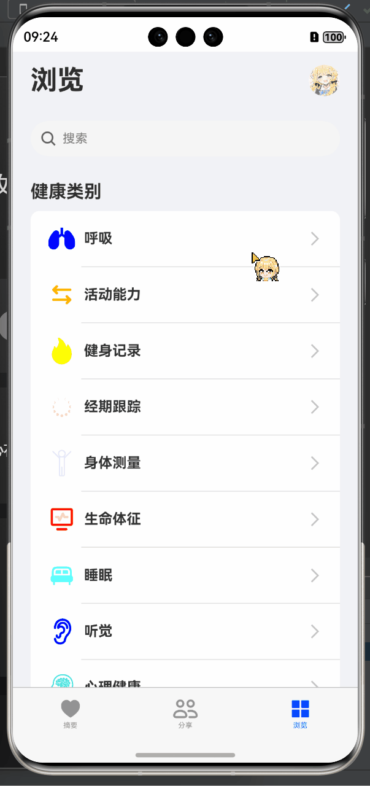

###### 路由导航
- 实现`navigateToCategoryDetail`方法处理类别点击导航：
  - 使用`router.pushUrl`进行页面跳转
  - 通过`params`传递类别标题等参数

###### UI组件构建
- 使用`@Builder`装饰器创建可复用UI组件：
  - `Search`: 搜索栏组件
  - `SearchBar`：搜索栏组件整体
  - `CategoryItem`：类别项组件
- 主界面使用`List`和`ListItem`构建垂直滚动列表
- 使用`ForEach`动态渲染过滤后的类别列表
- 实现空结果状态显示
**空结果状态显示效果如下图所示：**


##### 未来优化方向
1. **搜索历史记录**：添加最近搜索记录功能
2. **类别收藏**：支持用户收藏常用健康类别
3. **个性化排序**：基于用户使用频率动态调整类别顺序
4. **搜索建议**：实现智能搜索建议功能
5. **多维度过滤**：增加按颜色、使用频率等多维度过滤选项

#### 4.2.6.CategoryDetailPage

##### 功能概述
- **分类详情展示**：根据从BrowsePage传递的分类标题，显示该分类下的所有健康指标
- **数据状态区分**：清晰区分有数据和无数据的健康指标，提供不同的视觉呈现
- **导航控制**：提供返回按钮，支持用户返回上一级页面

##### 交互特性
- **返回导航**：点击返回按钮返回上一页面

实现的分类详情页面效果如下图所示：
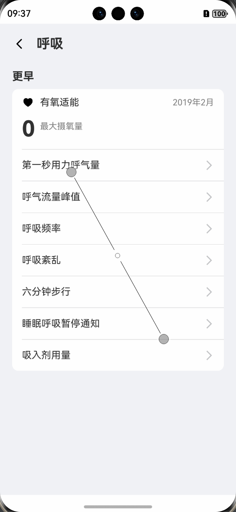


##### 未来优化方向
1. **完善分类数据**：为所有健康分类添加对应的指标数据
2. **数据录入功能**：实现点击无数据指标项后的数据录入界面
3. **数据可视化**：为有数据的指标添加趋势图表
4. **实时数据更新**：集成传感器数据，实现部分指标的实时更新
5. **数据导入导出**：支持从其他健康应用导入数据

#### 4.2.7.SharePage

##### 功能概述
- **主要功能**：管理健康数据共享，提供数据共享控制中心
- **核心用途**：允许用户管理与他人共享的健康数据，以及查看他人共享给自己的数据
- **目标用户**：需要与家人、医生或照护者共享健康数据的用户

##### 路由导航
- 使用 `router.pushUrl` 实现页面跳转，支持参数传递
- 点击"App"跳转至AppPage，点击"调研"跳转至ResearchPage
- 通过params传递页面标题，确保目标页面显示正确的标题

###### 视觉设计
- **卡片式布局**：使用圆角和白色背景创建卡片式UI
- **图标与文本组合**：结合图标和文本提升视觉吸引力
- **分隔线处理**：在列表项之间添加分隔线增强视觉层次
- **颜色对比**：使用蓝色突出重要按钮和图标，灰色表示次要信息
**下面是SharePage的视觉设计效果：**
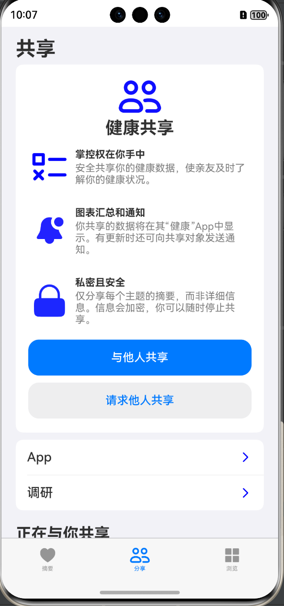


##### 未来优化方向
- **实现共享功能**：完成"与他人共享"和"请求他人共享"的实际功能
- **共享记录管理**：添加查看和管理共享记录的功能
- **权限精细控制**：允许用户精确控制共享数据的范围和时限
- **通知集成**：实现共享数据更新时的通知功能
- **数据加密**：增强共享数据的安全性和隐私保护

#### 4.2.8.ResearchPage

##### 功能概述
- **主要功能**：管理研究机构的数据访问权限
- **当前状态**：显示"无内容"，作为未来功能的占位页面
- **设计目的**：为用户提供参与健康研究的入口，同时保持数据控制权
**下面是ResearchPage的视觉设计效果：**
 


##### 数据结构设计
- 使用 `RouTmp` 接口定义路由参数结构，包含标题属性
- 通过 `router.getParams()` 获取路由参数，动态设置页面标题

###### 路由导航
- 使用 `router.back()` 实现返回上一页面的功能
- 通过点击返回按钮触发导航操作
- **返回导航**：支持通过返回按钮返回上一页面

#### 4.2.9.AppPage

##### 功能概述
- **主要功能**：显示可访问健康数据的应用列表
- **当前状态**：显示基本UI框架，内容为占位文本
- **设计目的**：为用户提供管理第三方应用数据访问权限的界面

##### 数据结构设计
- 使用 `RouTmp` 接口定义路由参数结构，包含标题属性
- 通过 `router.getParams()` 获取路由参数，动态设置页面标题

##### 路由导航
- 使用 `router.back()` 实现返回上一页面的功能
- 通过点击返回按钮触发导航操作
- **返回导航**：支持通过返回按钮返回上一页面

目前只是实现了UI框架，后续将添加实际内容。

### 4.3.页面跳转逻辑

#### 4.3.1.页面跳转逻辑示意图
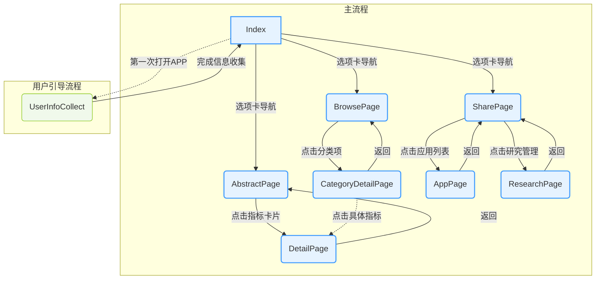

**页面跳转流程序列图**
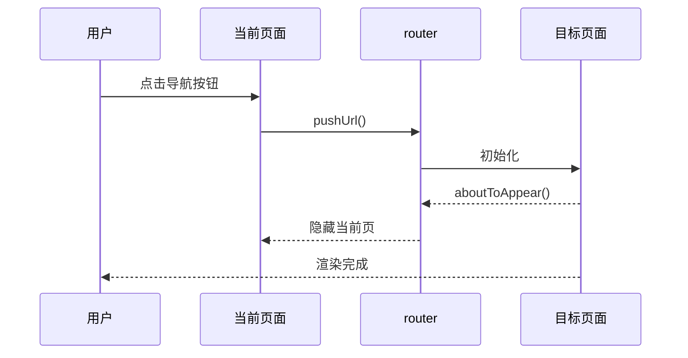

#### 4.3.2.跳转逻辑说明表

| 源页面          | 目标页面           | 触发条件                  | 参数传递                  |
| --------------- | ------------------ | ------------------------- | ------------------------- |
| Index           | AbstractPage       | 点击"摘要"选项卡          | 无                        |
| Index           | SharePage          | 点击"共享"选项卡          | 无                        |
| Index           | BrowsePage         | 点击"浏览"选项卡          | 无                        |
| AbstractPage    | DetailPage         | 点击任一健康指标卡片      | 类型/当前值/单位/历史数据 |
| BrowsePage      | CategoryDetailPage | 点击分类项                | 分类标题/关联指标列表     |
| SharePage       | AppPage            | 点击"APP"卡片             | 页面标题                  |
| SharePage       | ResearchPage       | 点击"研究"卡片            | 页面标题                  |
| UserInfoCollect | Index              | 完成用户信息收集          | 用户信息对象              |
| 所有页面        | 上一级页面         | 点击返回按钮/系统返回手势 | 无                        |


## 5.健康数据管理

### 5.1.数据模型设计


#### 5.1.1.核心数据结构

- **Health接口**：定义了健康数据的基本结构，包含以下关键指标：
  - 活动指标：步数、活动能量消耗、爬楼层数
  - 身体指标：BMI、身高、体重
  - 生理指标：心率、血氧饱和度、体温、压力水平
  - 睡眠指标：睡眠分析时长
  - 时间属性：记录日期

- **DefaultHealth常量**：提供默认健康数据值，用于初始化和重置

- **UserInfo接口**：存储用户个人信息，包括：
  - 基本信息：姓氏、名字、生日、性别
  - 身体数据：身高、体重
  - 应用设置：通知权限状态

##### 类图

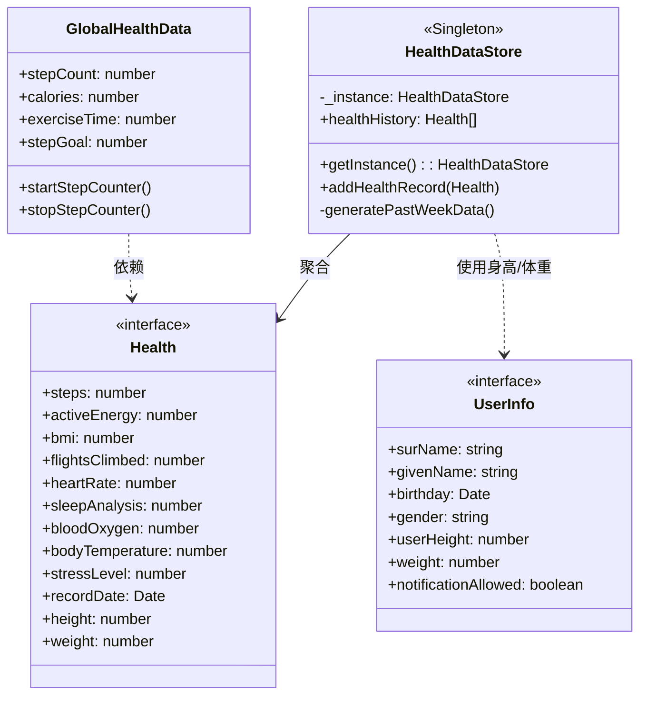

#### 5.1.2.全局健康数据管理

- **GlobalHealthData类**：实时健康数据追踪
  - 运动指标：步数、卡路里消耗、运动时间、步数目标
  - 状态标志：运动状态、计步器初始值、定时器ID

### 5.2.HealthDataStore单例模式

#### 5.2.1.设计原理

- **单例实现**：通过静态`_instance`属性和`getInstance()`方法确保全局唯一实例
- **私有构造函数**：防止外部直接实例化，保证数据一致性
- **观察者模式**：使用`@ObservedV2`装饰器实现数据变化的自动通知
- **追踪机制**：使用`@Trace`装饰器跟踪关键属性变化


#### 5.2.2.数据管理方法

- **addHealthRecord**：添加新的健康记录，同时维护最多7天的数据量
- **generatePastWeekData**：生成过去七天的模拟健康数据，用于初始化和演示

### 5.3.传感器集成

#### 5.3.1.步数传感器

- 使用`@kit.SensorServiceKit`的传感器API获取实时步数数据
- 通过`sensor.on()`方法订阅计步器传感器(PEDOMETER)
- 数据更新间隔设置为100000000纳秒，平衡实时性和性能

## 6.权限管理机制

#### 权限管理流程示意图
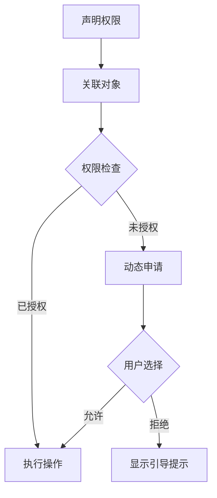

### 6.1.在`module.json5`声明权限
在`src/main/module.json5`中声明所需权限：
```json5
"requestPermissions": [
  {
    "name": "ohos.permission.INTERNET",
    "reason": "$string:reason",
    "usedScene": {
      "abilities": ["EntryAbility"],
      "when": "always"
    }
  },
]
```

### 6.2.权限关联
在GlobalHealthData类中关联权限与传感器功能：
```arkts
// Healthy.ets
const context = getContext(this) as common.UIAbilityContext;
activityManager.checkPermissions(context); // 关联上下文与权限
```

### 6.3.权限申请
采用分层申请策略：
```arkts
// ActivityManager.ets
public static async reqPermissionsFromUser(permissions: Array<Permissions>, 
  context: common.UIAbilityContext) {
  try {
    await abilityAccessCtrl.createAtManager().requestPermissionsFromUser(
      context, 
      permissions
    );
  } catch (err) {
    console.error(`权限申请失败: ${err.message}`);
  }
}
```

### 6.4.授权检查
在数据采集前验证权限：
```arkts
// Healthy.ets
public static checkPermissions(context: common.UIAbilityContext) {
  try {
    const atManager = abilityAccessCtrl.createAtManager();
    const grantStatus = atManager.checkAccessToken(
      context.tokenId, 
      permissions
    );
    return grantStatus === 0; 
  } catch (err) {
    console.error(`权限检查异常: ${err.message}`);
    return false;
  }
}
```
### 6.5.权限序列图
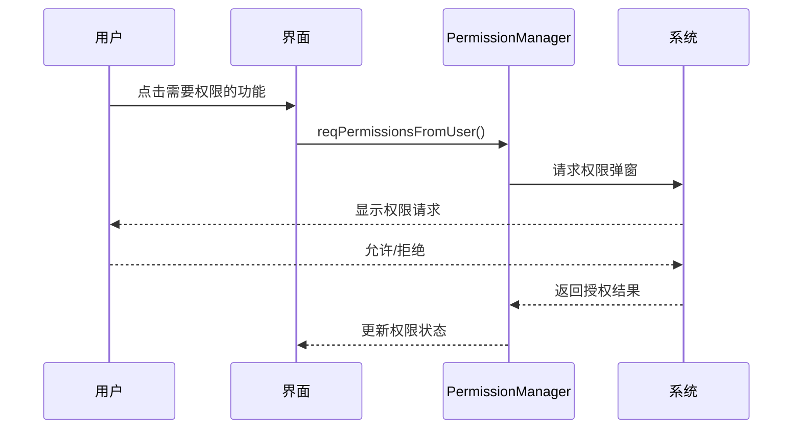

## 7.本地化适配

### 7.1.已实现
- 单位智能转换（公制/英制）
- 区域化时间格式
### 7.2.待实现
- 语言本地化
- 布局自适应不同屏幕尺寸

## 8.开发环境指南

### 环境要求
- **IDE**：DevEco Studio 5.0.4
- **SDK**：HarmonyOS 5.0 API 17

## 9.项目整体未来计划

- 完善 `ResearchPage`，添加研究权限管理功能，增加**模糊搜索功**能。
- 扩展 `BrowsePage` 和 `CategoryDetailPage`，支持更多健康分类和指标。
- 增强数据可视化，引入更复杂的图表类型。（例如苹果“健康”软件中折线图的缩略图/完整图绘制功能）
- 增加一天内/一个月/半年/一年时间跨度的数据展示。
- 优化用户引导流程，增加单位选择等个性化选项。

## 许可证（MIT Licence）

本项目遵循MIT许可证。

### 被授权人权利
被授权人有权利使用、复制、修改、合并、出版发行、散布、再授权及贩售软件及软件的副本。
被授权人可根据程序的需要修改授权条款为适当的内容。

### 被授权人义务
在软件和软件的所有副本中都必须包含版权声明和许可声明。

Permission is hereby granted, free of charge, to any person obtaining a copy of this software and associated documentation files (the “Software”), to deal in the Software without restriction, including without limitation the rights to use, copy, modify, merge, publish, distribute, sublicense, and/or sell copies of the Software, and to permit persons to whom the Software is furnished to do so, subject to the following conditions:

The above copyright notice and this permission notice shall be included in all copies or substantial portions of the Software.

THE SOFTWARE IS PROVIDED “AS IS”, WITHOUT WARRANTY OF ANY KIND, EXPRESS OR IMPLIED, INCLUDING BUT NOT LIMITED TO THE WARRANTIES OF MERCHANTABILITY, FITNESS FOR A PARTICULAR PURPOSE AND NONINFRINGEMENT. IN NO EVENT SHALL THE AUTHORS OR COPYRIGHT HOLDERS BE LIABLE FOR ANY CLAIM, DAMAGES OR OTHER LIABILITY, WHETHER IN AN ACTION OF CONTRACT, TORT OR OTHERWISE, ARISING FROM, OUT OF OR IN CONNECTION WITH THE SOFTWARE OR THE USE OR OTHER DEALINGS IN THE SOFTWARE. 